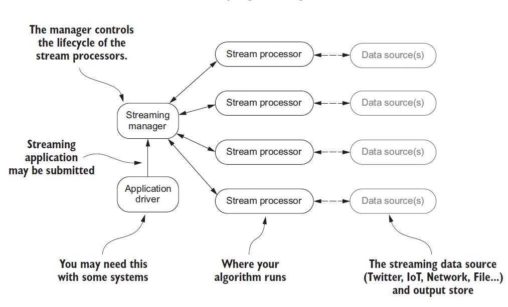

## Overview

Spark, Storm, Flink, and Samza all have the following three common parts:
- A component that your streaming application is submitted to; this is similar to how Hadoop Map Reduce works. Your application is sent to a node in the cluster that executes your application.
- Separate nodes in the cluster execute your streaming algorithms.
- Data sources are the input to the streaming algorithms.
### A Generalized Architecture

#### Application driver
- With some streaming systems, this will be the client code that defines your streaming programming and communicates with the streaming manager. 
- For example, with Spark Streaming your client code is broken into two logical pieces: the driver and the streaming algorithm(s) or job. The driver submits the job to the streaming manager, may collect results at the end, and controls the lifetime of your job.
#### Streaming manager
- The streaming manager has the general responsibility of getting your streaming job to the stream processor(s); in some cases it will control or request the resources required by the stream processors.
#### Stream processor
- This is where your job runs. The purpose is to execute the job that was submitted.
#### Data source(s)
- This represents the input and potentially the output data from your streaming job. With some platforms your job may be able to ingest data from multiple sources in a single job, whereas others may only allow ingestion from a single source. 
- One thing that may not be obvious from the architectures is where the output of the jobs goes. In some cases you may want to collect the data in your driver; in others you may want to write it out to a different data source to be used by another system or as input for another job.