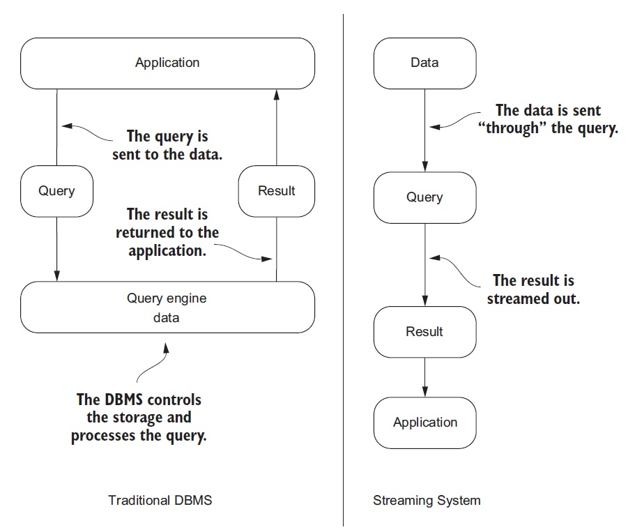
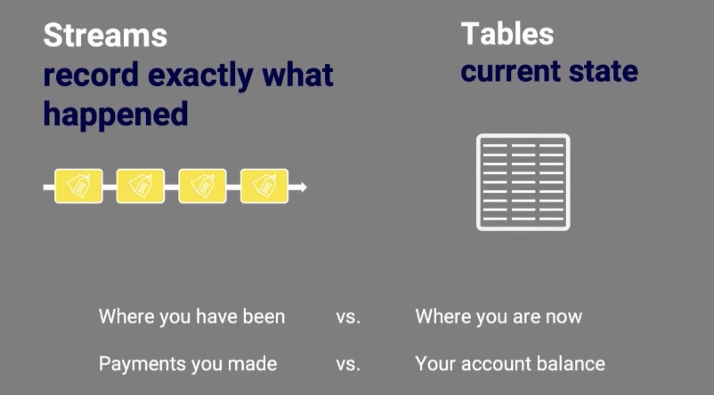
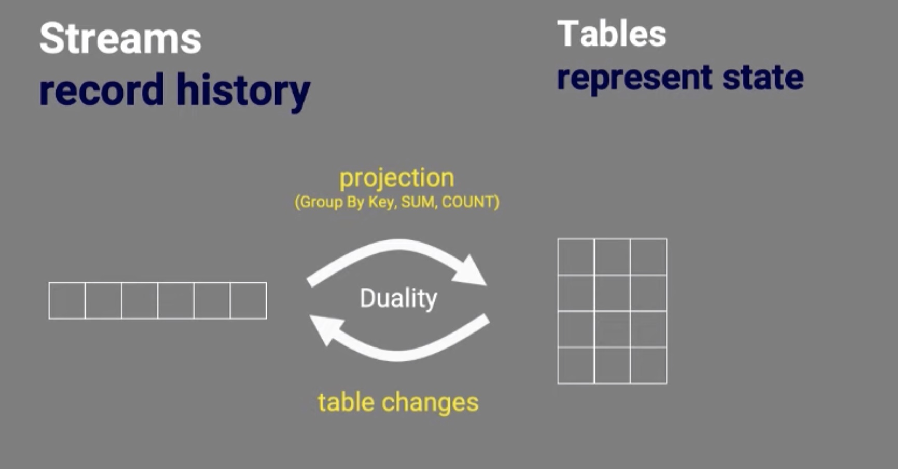

## Overview

* The idea behind stream processing is that rather than saving data to storage and processing  the data in batches afterward, ***events are processed in flight***
* Unlike batch processing in which there is a defined beginning and end of a batch, in stream processing,  the processor is long-lived and operates constantly on small batches of events   as they arrive
* Stream processing is often used to look at data and make immediate decisions on how to transform,  aggregate, filter, or alert on data
* Real-time processing can be useful in :
	- model scoring
	- complex event processing
	- data enrichment, or many other types of processing. 
* These types of patterns apply in a variety of domains for which the ***time-value*** of the data is high,  meaning that the data is most valuable soon after creation and then diminishes thereafter. Many types of fraud detection, healthcare analytics, and IoT use cases fit this pattern. 
* A major factor limiting adoption of real-time processing  is the challenging demands it places  on data storage
### The Continuous Query Model

 - In non-streaming systems (traditional DBMS (RDBMS, Hadoop, HBase, Cassandra, and so on)) ***the data is at rest, and we query it for answers***. In the traditional DBMS the ***query is sent to the data*** and executed, and the result is returned to the application
- In a streaming system, this model is completely changed—***the data is sent “through” the query,*** and the result is sent to an application. 
- In a streaming system a user (or application) registers a query that’s executed every time data arrives or at a predetermined time interval
- The result of the query is then pushed to the client. This model is called the ***continuous query model***, meaning the query is constantly being evaluated as new data arrives
- The ***data is being pulled or pushed through our system in a never-ending stream.***

>***Streaming systems inverts the traditional data management model by assuming users to be passive and the data management system to be active.*** 

### Stream Table Duality

#### Stream 
- **An _event stream_ records the history of what has happened in the world as a sequence of events.*, so we know which event happened before another event to infer causality 
- A **stream** provides immutable data. It supports only inserting (appending) new events, whereas existing events cannot be changed. 
- You could consider a stream to be like a table in a relational database (RDBMS) that has no unique key constraint and that is append only.
#### Table
- Compared to an event stream, **a _table_ represents the state of the world** at a particular point in time, typically “now.” 
- A **table** provides mutable data. New events—rows—can be inserted, and existing rows can be updated and deleted. 

### Convergence of Stream and table

There is a close relationship between a stream and a table. We call this the [stream-table duality](https://www.confluent.io/blog/streams-tables-two-sides-same-coin/). What this means is that we can convert one to another :
1. **Streams → tables** : We can turn a stream into a table by aggregating the stream with operations such as COUNT() or SUM(), for example. 
2. Tables → streams
- We can turn a table into a stream by capturing the changes made to the table—inserts, updates, and deletes—into a “change stream.” This process is often called [change data capture](https://en.wikipedia.org/wiki/Change_data_capture) or CDC for short. 
- In fact, a table is fully defined by its underlying change stream. Major relational database such as Oracle  or MySQL, these change streams exist there, by names such as ***redo log*** or ***binlog***

## References

https://www.confluent.io/blog/kafka-streams-tables-part-1-event-streaming/
