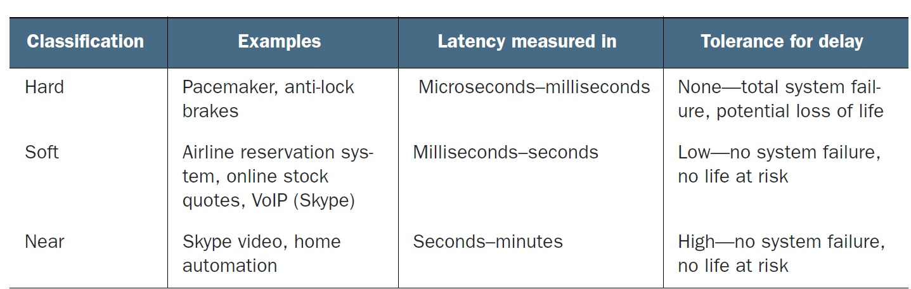
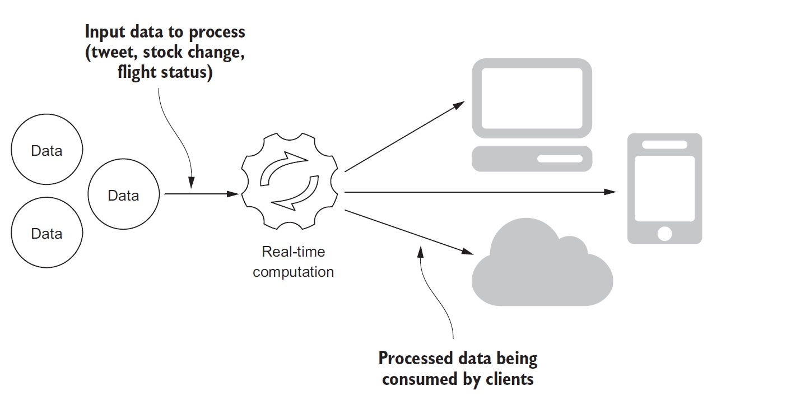
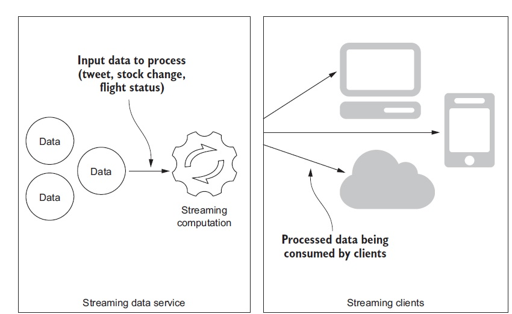

## Overview
#### Classification of Real-time systems

What constitutes a real-time system? Real-time systems are classified as 
- Hard
- Soft
- Near

For near real-time : “Denoting or relating to a data-processing system that is slightly slower
than real-time.”

You can identify hard real-time systems fairly easily. They are almost always found in embedded systems and have very strict time requirements that, if missed, may result in total system failure.  Differentiating soft and near real-time becomes blurry, at times disappears, is very subjective, and may often depend on the consumer of the data.

It can be stated as follows: 

***Is the process of receiving data all the way to the point where it is ready for consumption a soft or near real-time process?***
#### Differences between real-time and streaming systems

 ***A system may be labeled soft or near real-time based on the perceived delay experienced by consumers.***  

In many scenarios, the computation part of the system is operating in a non-hard real-time fashion, but the clients may not be consuming the data in real time due to network delays, application design, or a client application that isn’t even running.  

Put another way, what we have is a non-hard real-time service with clients that consume data when they need it. This is called a ***streaming data system—a non-hard real-time system that makes its data available at the moment a client application needs it.*** It’s neither soft nor near—it is streaming

