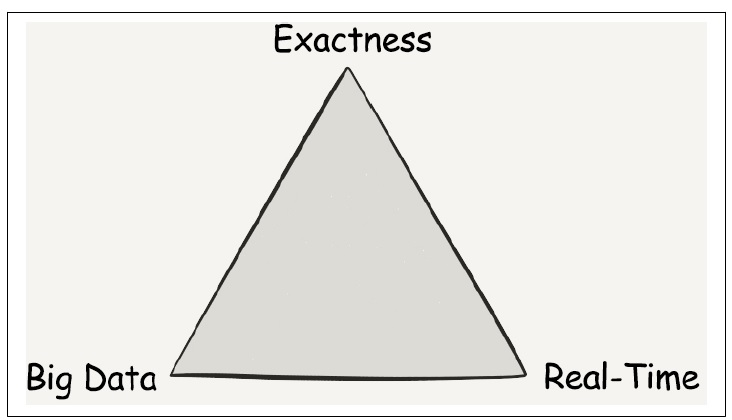
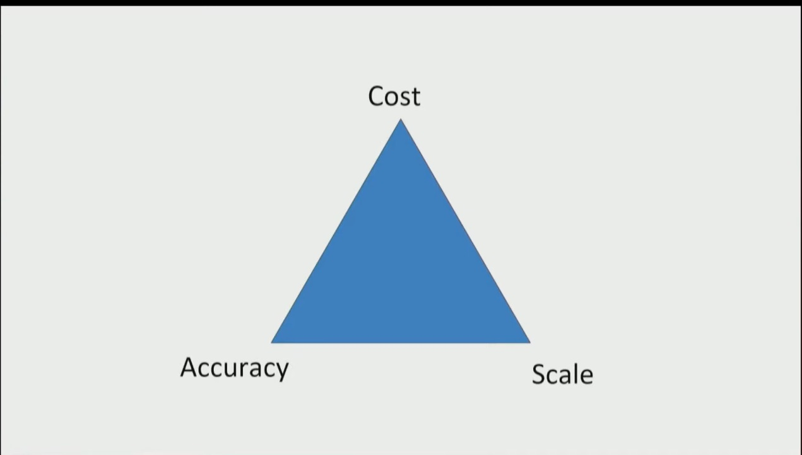
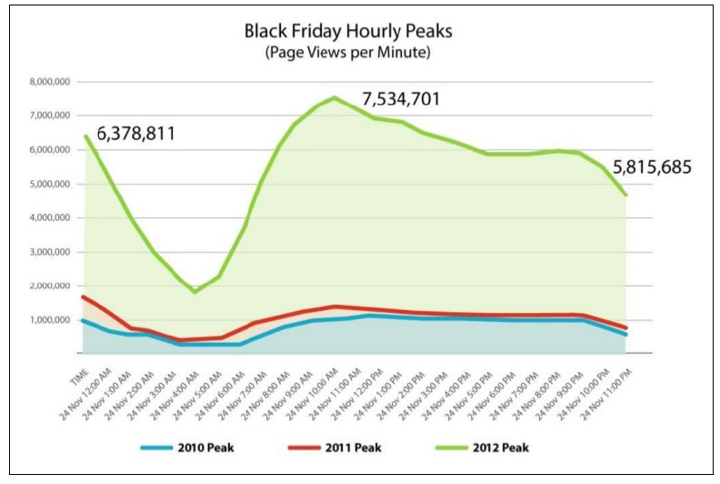
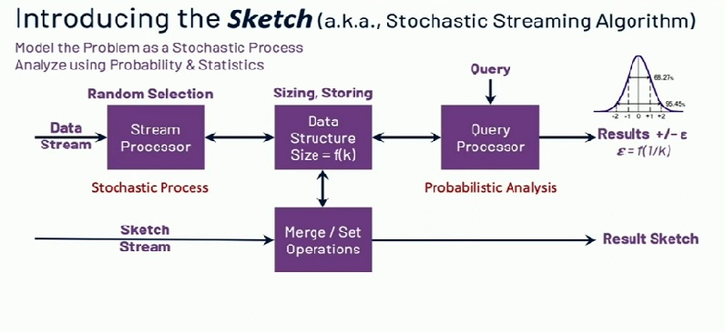
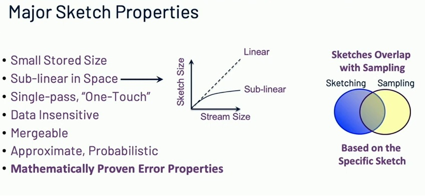

## Overview

Stream processing poses particular challenges when it comes to producing summaries of the observed data over time. Because of the nature of stream processing, we don’t know if the stream will ever end, nor can the entirety of it fit in memory. That makes it extremely difficult to provide exact answers to questions about the data in the stream
### Exactness, Real Time, and Big Data

Distributed computing, when operating on a continuous flow of data is often considered a special beast in that it’s constrained by a triangle of concepts:

1. **Exactness**
	- We can see exact computation as the reflection of the need to produce a precise numerical result answering a question that we ask from our data. 
2. **Real-Time Processing**
	- The second aspect is the freshness or latency of that analysis. 
	- In this context, latency relates to the time between the moment when data is first available and when we can get some insights from it
3. **Big Data :** 
	- Computation on large data set -  how voluminous is the data that we are dealing with? 

The notions of exactness, real-time processing, and data size can be represented as a triangle :

***This triangle reflects that achieving exactness and freshness (near-real-time results) are at odds as the volume of data increases: these three needs are rarely all met at the same time.***

**Put differently, it a tradeoff between Cost, Accuracy and Scale**

### Need for Approximation

For example, Walmart is a commercial retail website that is accessed frequently by about 300 million distinct users per month in 2018. However, during Black Friday in 2012, the number of users that visited the Walmart website to benefit from sales on that particular day doubled in a matter of hours, as depicted in the figure, in a way that was not predictable from analyzing the traffic of the prior years.  The resources needed in the website’s infrastructure to process that new influx of users was suddenly much higher than what had been anticipated. The scalability problem has an impact on our ability to produce real-time answers. It  would take us a much longer time to count the web sessions of distinct users on the Walmart website on Black Friday than on any other day. 

***In this case, it is more useful to have an approximate answer to our question that comes in very fast rather than an exact answer that comes in delayed. The approximate answer is easier to compute, but still an operational value*** 

In summary:
	• Exact algorithms are more accurate, but very resource intensive
	• Approximation algorithms are less accurate, but we’re willing to accept a bit less accuracy rather than take on the extra resource cost.
### Approximation Algorithms

If approximate results are acceptable, there is a class of specialized algorithms, ***called streaming algorithms, or [sketches](https://datasketches.apache.org/docs/Background/SketchOrigins.html)*** that can produce results orders-of magnitude faster and with mathematically proven error bounds.

The name ***"sketch"***, with its allusion to an artist's sketch, has become the popular term to describe algorithms that return "good enough” approximate answers to queries, as these algorithms typically create small summary data structures that approximately resemble the much larger stream that it processed.

**Streaming algorithms** are algorithms for processing [data streams](https://en.wikipedia.org/wiki/Data_stream "Data stream") in which the input is presented as a [sequence](https://en.wikipedia.org/wiki/Sequence "Sequence") of items and can be examined in only a few passes, typically [just one](https://en.wikipedia.org/wiki/One-pass_algorithm "One-pass algorithm")

These algorithms are designed to operate with limited memory, generally [logarithmic](https://en.wikipedia.org/wiki/L_(complexity) "L (complexity)") in the size of the stream and/or in the maximum value in the stream, and may also have limited processing time per item.

As a result of these constraints, streaming algorithms often produce approximate answers based on a summary or ***"sketch*** of the data stream.
#### Families of Sketch Algorithms

##### Sampling
- For data analytics under the constraints of time, sampling can enable the use of heavier algorithms on smaller datasets. 
- Dominating trends of the original dataset will also appear on the sample, provided that the sampling technique used do not introduce any bias
- Notable sketches:
	- Reservoir Sampling
##### Cardinality Estimation
- You may want to count the distinct items in a stream, but remember we are constrained by memory and don’t have the luxury of storing the entire stream ( How many unique items in a list ? )
- Notable sketches:
	- HyperLoglog  (HLL)
	- Theta Sketch
	- Tuple Sketch
	- CPC Sketch
##### Frequent Items / Heavy Hitters Sketches
- This class of algorithms helps in determining the distinct count for a stream. ( How many times have I seen this element? )
- The term _Heavy Hitter_ is defined to be an item that occurs more frequently than its fair share of occurrences.
- Notable sketches:
	- Count-min Sketch
##### Membership
- The question we’re asking now is: Has this stream element ever occurred in the stream before?
- Notable sketches:
	- Bloom Filter
	- Cuckoo Filter
##### Ranks and Quantiles
- There are many situations where is valuable to understand the distribution of values in a stream. For example, from a stream of web-page time-spent values, it would be useful to know arbitrary quantiles of the distribution, such as the 25th percentile value, the median value and the 75th percentile value.
- Notable sketches:
	- KLL Sketch
	- Quantiles Sketch
	- T-Digest
