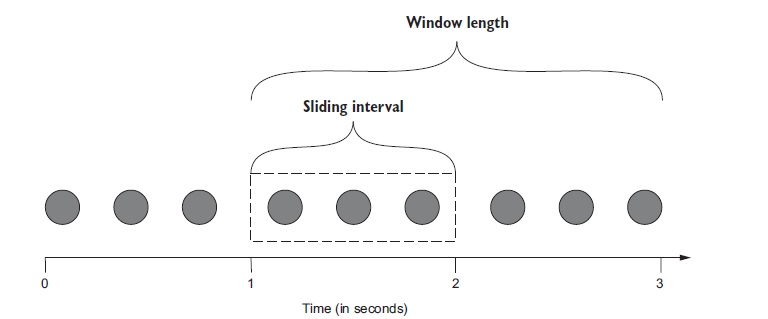
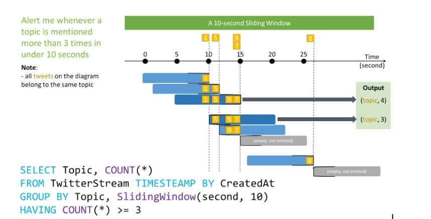
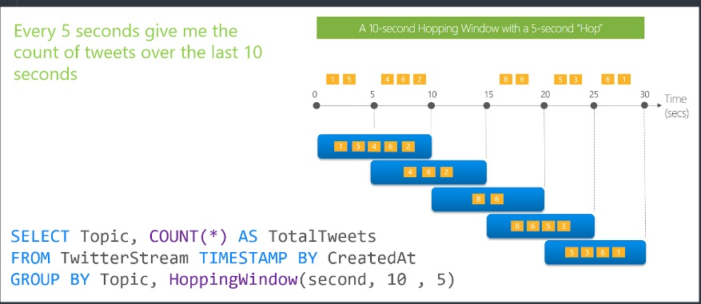
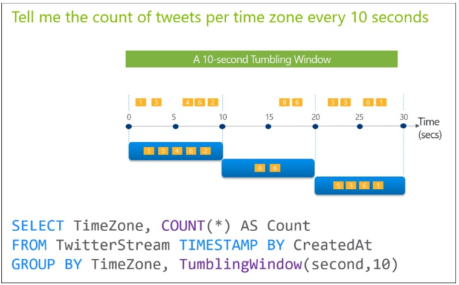
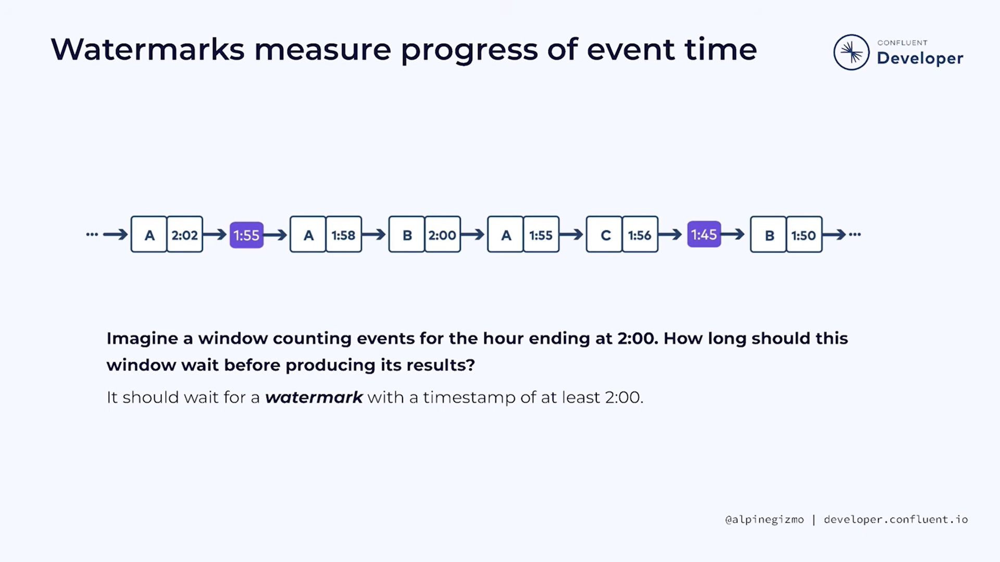
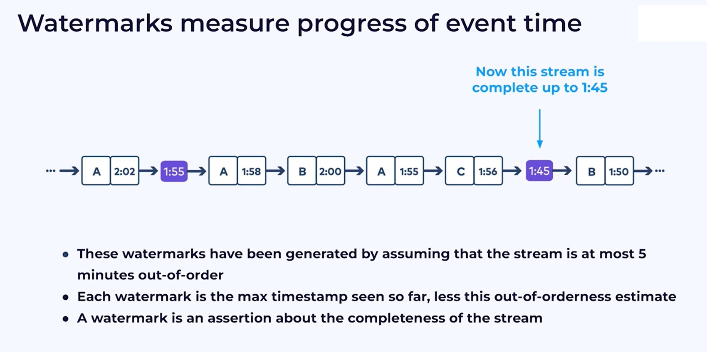

## Overview

A window of data represents a certain amount of data that we can perform computations on. It essentially means chopping up a dataset into finite pieces along temporal boundaries.

The added complexity comes by the way of two attributes common to all windowing techniques: 
1. **Trigger policy -**  The trigger policy defines the rules a stream-processing system uses to notify our code that it’s time to process all the data that is in the window
2. **Eviction policy**- The eviction policy defines the rules used to decide if a data element should be evicted from the window
### Window Processing

#### Sliding 
- The sliding window technique uses eviction and trigger policies that are based on time.
- A sliding window is re-evaluated only if the content of the window changes,  i.e. each time a new record enters or leaves the window. 
- Sliding windows, unlike Tumbling or Hopping windows, output events only for points in time when the content of the window actually changes. In other words, when an event enters or exits the window. So, every window has at least one event



In figure  the window length is two seconds; as new data arrives, data that is older than two seconds will be evicted. This means that every second our code would be triggered, and we would be able to process the data in the sliding interval as well as the entire window length.
##### Use Case 1 : Moving averages
This type of window is good for a “moving average” computation as an example.  As long as no new records arrive, the result (current average) does not change and thus you don’t want to get the same result sent downstream over and over again. Only if a record enters or leaves the window, and the average changes you want to get an update. 
##### Use Case 2 : Alerting on a threshold 
It’s only useful to re-evaluate the threshold if it did change; there is no advantage to evaluate the same result in fixed time intervals.  


#### Hopping Window
- Hopping window functions hop forward in time by a fixed period.
- For hopping windows, the window is re-evaluated on fixed time intervals, independent of the actual content of the data stream (ie, independent of the records).
- You could use a hopping window if you need to get periodic results. 
##### Differences & similarities between sliding and hopping window
- The core difference is the “triggering” behavior of each window.
	- The Hopping window is more schedule based, producing output on every period for exactly that period. 
	- The Sliding window is more event based, producing output only when data is present
- For both Sliding  and Hopping windows, events can belong to more than one sliding window
##### Use Case : Every X unit of time, process for Y unit of time


#### Tumbling window
- Tumbling windows are a special case of hopping windows. ***They model fixed-size, non-overlapping, gap-less windows.*** 
- All tumbling windows are the same size and adjacent to each other, which means that whenever a window ends, the next window starts.
- Since ***tumbling windows never overlap,*** a record will belong to one and only one window
- A tumbling window is a hopping window whose  trigger policy/window duration is equal to its eviction policy/advance interval
##### Use Case : Count element per X unit of time


### Dealing with out-of-order and late data : Watermarks

- A watermark is a measure of input completeness with respect to event times. As such, watermarks act as a metric of progress when observing an unbounded data source with no known end.
- They help in answering two fundamental question -
	1. Where in event-time processing is taking place 
	2. When in processing time results are materialized (with aid of Triggers)


#### How is a (high) watermark calculated?

```
W = max event time seen by the engine - late threshold
```

A watermark with value of time X makes the statement  :***“all input data with event times less than X have been observed.”*** In other words, ***it’s an assertion that no more data with event times less than E will ever be seen again.***



For example, if the max event time seen is 1:55 and the late threshold is 10 min, then the watermark value is 1:45
- All states related to data before the watermark value gets dropped
- Late data within the threshold will be aggregated, but data later than the threshold will start getting dropped

