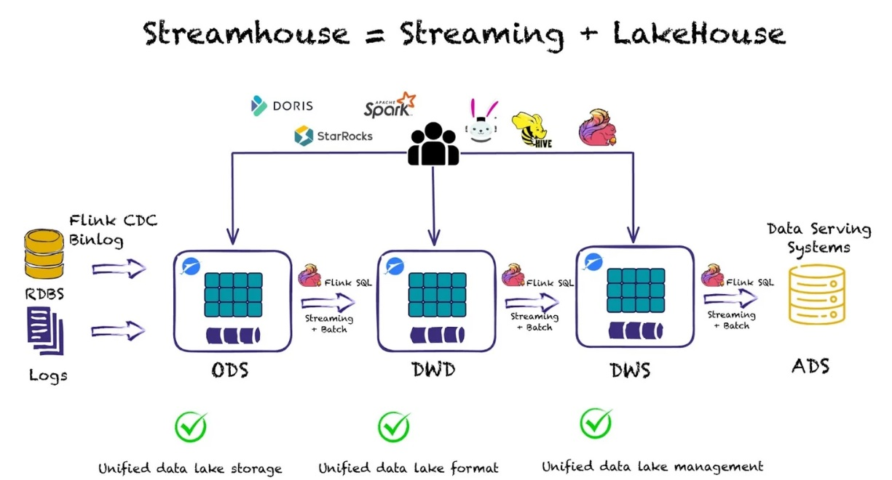
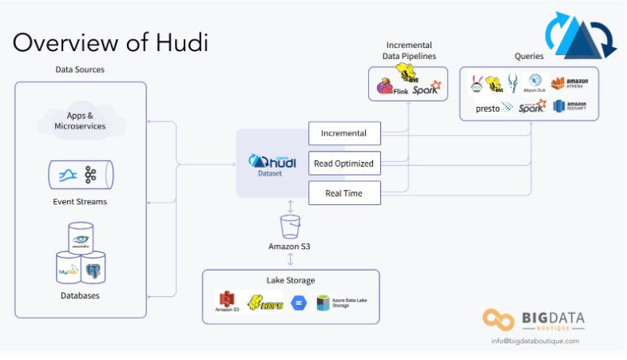
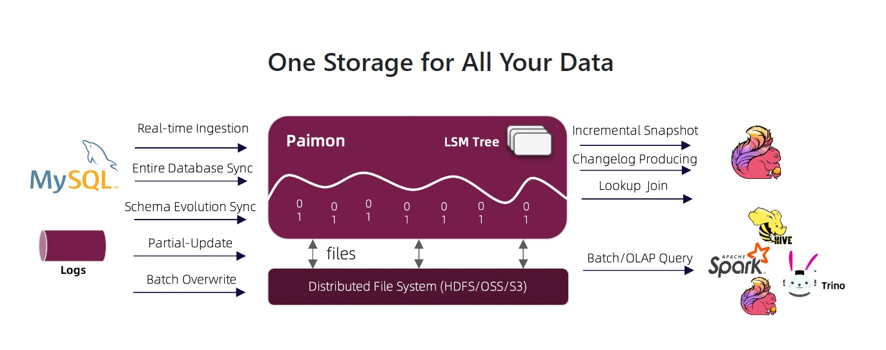
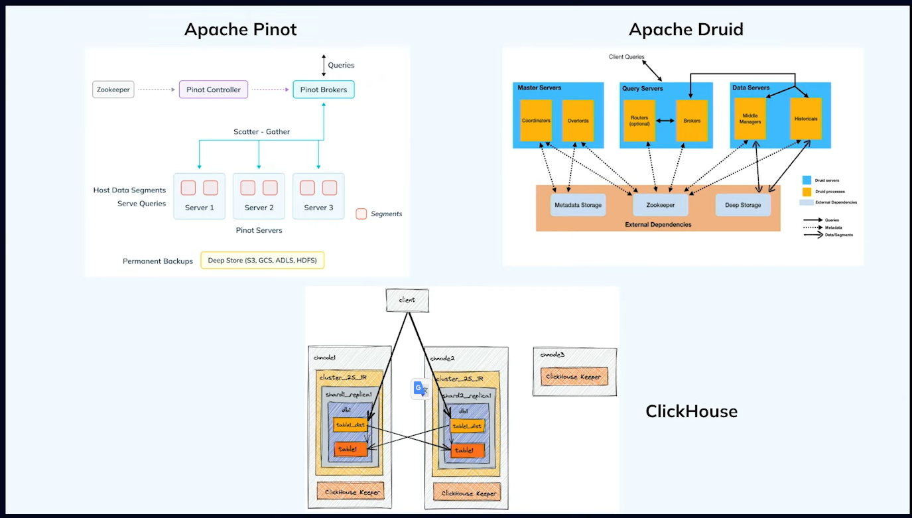
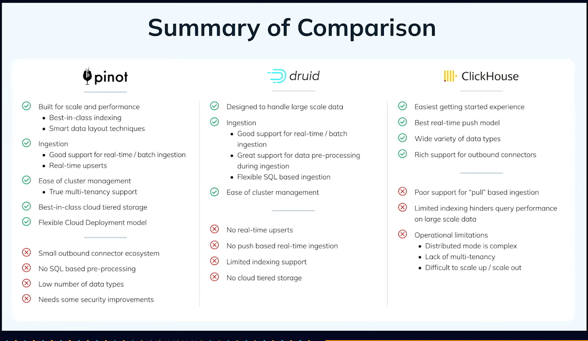

### Engines with Specialized Storage aka Streaming Lakehouse

  

#### Contenders

##### Apache Hudi

  
##### Delta Lake

##### Apache Paimon

### Realtime OLAPs 

With the shift in the analytical landscape from traditional OnLine Analytical Processing (OLAP), which was batch-oriented in nature, to real-time OLAP. 

Instead of generating reports or dashboards which are hours delayed, we now want to analyze data as its being generated - within milliseconds. Real-time OLAP engines cater to the need for low-latency response to user queries.

It employs several technologies such as data sharding, vectorized processing, pre-aggregation, and index constructions to ensure that results can be returned to users in ultra-low latency.

***Real-time databases can not only store data but also ingest data directly from the data source.*** This means that users can access the latest data in real time while achieving efficient analytical queries

#### Contenders
- Apache Druid
- ClickHouse
- Apache Pinot

#### Summary of features

## References

https://startree.ai/blog/a-tale-of-three-real-time-olap-databases

https://www.clouddatainsights.com/real-time-olap-databases-and-streaming-databases-a-compariso

