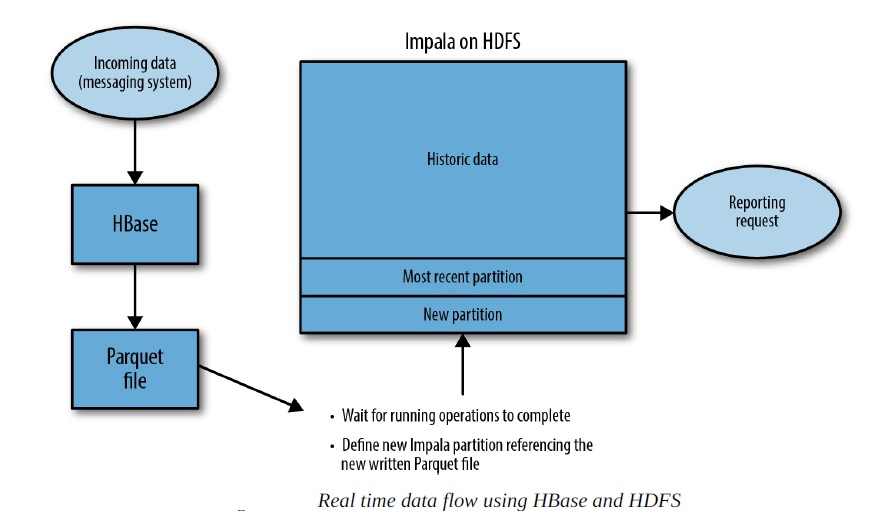
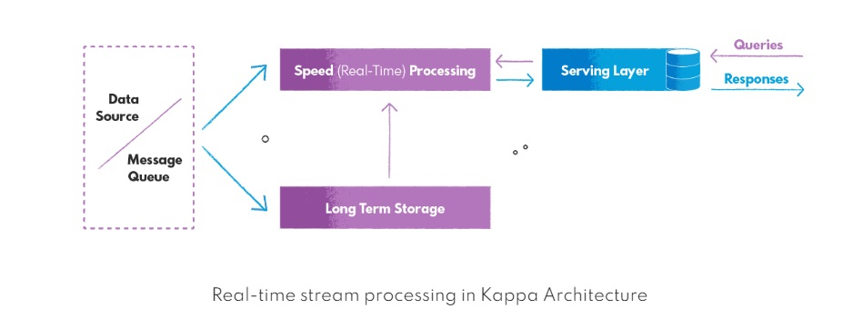
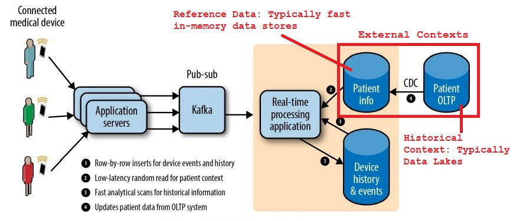

## Background

Hadoop was a revolutionary product that enabled organizations derive insights from massively large datasets, but soon enough Hadoop started being stretched in terms of the use cases it’s being expected to solve. 
### Use Case : IOT

Let's say we have a use case for IOT where want to be able to stream events from connected devices into a storage layer, whatever that might be, and then be able to query the data in just a couple ways.
#### Access pattern 1 : Row lookup
First, ***we want to be able to see what’s happening with the device right now.***  For example, after rolling out a software update to our device, we want to be able look at up-to-the-second signals coming off the device to understand if our update is having the desired effect or encountering any issues. 
#### Access pattern 2 : Analytics
The other access pattern is ***analytics***; we have data analysts who are looking for trends in data to gain new insights to understand and report on device performance, studying, for example, things like battery usage and optimization.

### Storage layer capabilities

To serve these basic access patterns the ***storage layer needs the following capabilities:***

1. **Row-by-row inserts** - When the application server or gateway device receives an event, it needs to be able to save that event to storage, making it immediately available for readers.
2. **Low-latency random reads** - After deploying an update to some devices, it needs to analyze the performance of a subset of devices and time. This means being able to efficiently look up a small range of rows.
3. **Fast analytical scans :** To serve reporting and ad hoc analytics needs, we need to be able to scan large volumes of data efficiently from storage.
4. **Updates :** Contextual information can change. For example, contextual information being fed from Online Transactional Processing (OLTP) applications might populate reference data like contact information, or a patient’s risk score might be updated as new information is computed.

Taken separately, the Hadoop storage layers can handle fast inserts, low-latency random reads, updates, and fast scans. 
- Low-latency reads and writes: HBase
- Fast analytics : HDFS

The trouble comes when you ask for all those things: row-by-row inserts, random-reads, fast scan, and updates —all in one. This realization to accommodate these access patterns from a single storage layer, this led to the emergence of the the Lambda Architecture

## The emergence of Greek Letter Architectures

### Lambda Architecture

The **lambda architecture**, first proposed by Nathan Marz ( creator of [Apache Storm](http://storm.apache.org/) project.) Somewhere in 2011.

All data coming into the system goes through these two paths:
1. A **batch layer** (cold path) stores all of the incoming data in its raw form and performs batch processing on the data. The result of this processing is stored as a **batch view**.
- A **speed layer** (hot path) analyzes data in real time. This layer is designed for low latency, at the expense of accuracy.

The final layer in this architecture is the ***serving Layer***. It is typically implemented as a layer on top of the batch and stream processing layers and is responsible for serving query results to users in real time.

#### Issues

A drawback to the lambda architecture is its complexity. Processing logic appears in two different places — the cold and hot paths — using different frameworks. This leads to duplicate computation logic and the complexity of managing the architecture for both paths.

### Kappa Architecture

Kappa Architecture is a variant of the Lambda Architecture that has gained popularity in the big data world.  It was introduced by Jay Kreps in 2014, and since then, it has become a standard for processing real-time data streams. 

Kappa is more simpler in terms of layers :

1. **Ingestion Layer:** 
  - This layer is responsible for collecting data from various sources, such as log files, IoT devices, or other streaming sources.
  - Data is streamed into the system, processed in real-time, and stored immediately in the storage layer.
2. **Processing Layer:** 
-  This layer is responsible for processing the data that is received from the ingestion layer. 
- The processing layer can perform various tasks such as filtering, aggregation, enrichment, and transformation of data.
3. **Storage Layer:** 
  - This layer stores all the processed data, and it can be queried in real-time.
  - The storage layer can be implemented using a database or a data warehouse.
#### Issues

***Batch gives insights based on historical data and trends, Stream allows us to act on the insights faster***

* ***Stream processing often requires external context.*** That context can take many different forms.
* In some cases, you need ***historical context*** and you want to know how the recent data compares to data  points in history.  Historical data will include features like the number of transactions in the past 24 hours or the  past week.
* In other cases, ***referential data*** is required. Referential features might include things like a customer’s account information or the location of an IP address
* Fraud detection, for example, relies heavily on both historical and referential data. 

  
Although processing frameworks like Apache Flume, Storm, Spark Streaming, and Flink provide the ability to  read and process events in real time, they rely on external systems for :
  1. For storage
  2. Access of external context

For example, when using Spark Streaming, you could read micro-batches of events from Kafka every few seconds.  If you wanted to be able to save results, read external context, calculate a risk score, and update a patient profile, you now have a diverse set of storage demands.

## Tiered storage : best of both worlds? 
- Tiered storage is a method of storing data in different storage tiers, based on the access patterns and performance requirements of the data. 
- The idea behind tiered storage is to optimize storage costs and performance by storing different types of data on the most appropriate storage tier. 
- In Kappa architecture, tiered storage is not a core concept. However, it is possible to use tiered storage in conjunction with Kappa architecture, as a way to optimize storage costs and performance. 
- For example, businesses may choose to store historical data in a lower-cost fault tolerant distributed storage tier, such as object storage, while storing real-time data in a more performant storage tier, such as a distributed cache or a NoSQL database. 

**Tiered storage Kappa architecture makes it a cost-efficient and elastic data processing technique without the need for a traditional data lake.**
## References

https://www.oreilly.com/radar/questioning-the-lambda-architecture/
