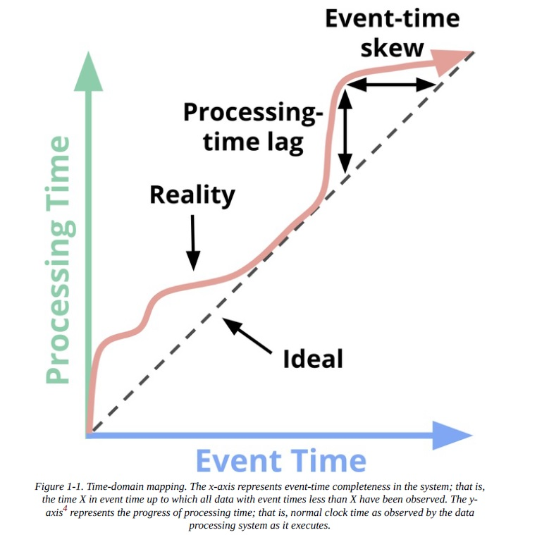

## Overview 

In  a streaming system, the data is constantly flowing.  It may be out of order when we see it  or delayed —and we can’t query all the data at once, because the stream never ends
### Domains of time 

To speak cogently about unbounded data processing requires a clear understanding of the domains of time involved.  Within any data processing system, there are typically two domains of time that we care about:
#### Event time
- This is the time at which events actually occurred. 
- Not all use cases care about event times
- Examples include characterizing user behavior over time, most billing applications, and many types of anomaly detection, to name a few.
#### Processing time
- This is the time at which events are observed in the system
    
Imagine we are collecting data from a fitness-tracking device such as a Apple Watch, and the data is flowing into our streaming system. 
- Stream time would be when the fitness event enters the analysis engine 
- Event time would be when it takes place on the device. 
### Time Skew
In an ideal world, event time and processing time would always be equal, with events being processed immediately as they occur.  Reality is not so kind, however, and the skew between event time and processing time is not only non-zero, but often a highly variable function of the characteristics of the underlying input sources, execution engine, and hardware. 

Things that can affect the level of skew include the following:
- Shared resource limitations, like network congestion, network partitions, or shared CPU in a non dedicated environment
- Software causes such as distributed system logic, contention, and so on
- Features of the data themselves, like key distribution, variance in throughput, or variance in disorder (i.e., a plane full of people taking their phones out of airplane mode after having used them offline for the entire flight)

### Windowing

- The important takeaway regarding lag/skew is this:  Because the ***overall mapping between event time and processing time is not static*** (i.e., the lag/skew can vary arbitrarily over time), this means that you cannot analyze your data solely within the context of when they are observed by your pipeline if you care about their event times (i.e., when the events actually occurred).
- To cope with the infinite nature of unbounded datasets, these systems typically provide some notion of windowing the incoming data.  It essentially means chopping up a dataset into finite pieces along temporal boundaries.
- If you care about correctness and are interested in analyzing your data in the context of their event times, you cannot define those temporal boundaries using processing time (i.e., processing-time windowing)