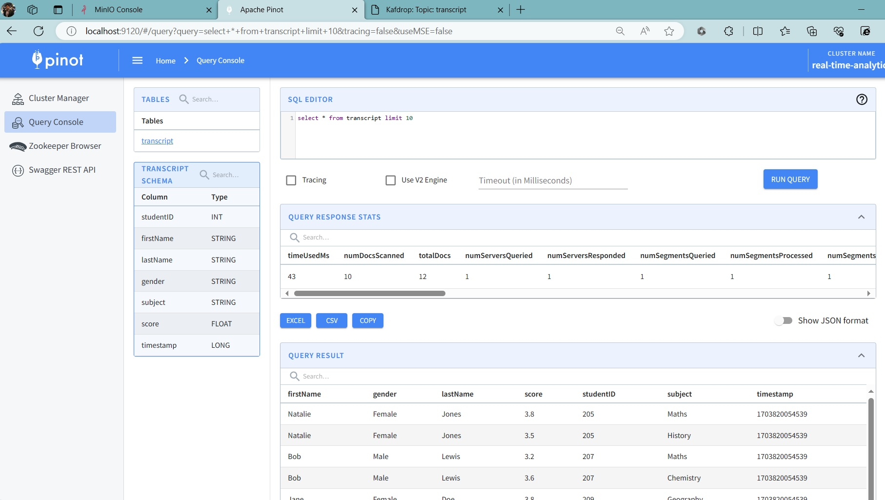
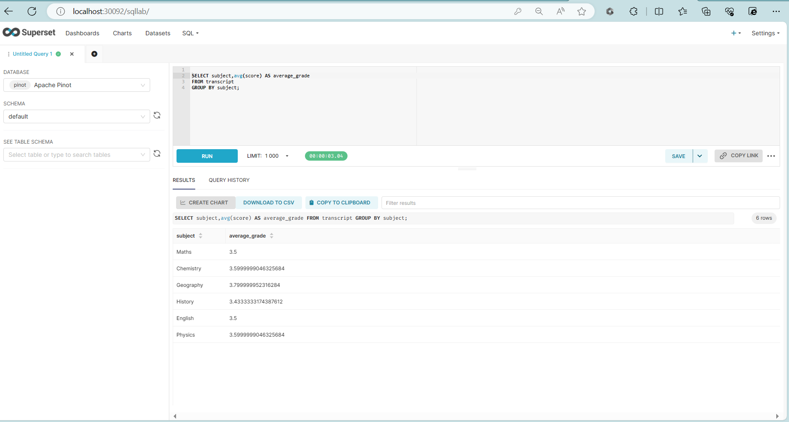

# Simple Stream Ingestion Example

## Uploading your schema and table config

* As soon as the realtime table is created, it will begin ingesting from the Kafka topic
* The command needs to be executed on the controller node

```bash
docker container exec -it pinot-controller \
/opt/pinot/bin/pinot-admin.sh AddTable \
-schemaFile /opt/examples/streaming/transcript/transcript-realtime-schema.json \
-tableConfigFile /opt/examples/streaming/transcript/transcript-table-realtime.json \
-exec
```

Drop table after use :

```shell
/opt/pinot/bin/pinot-admin.sh ChangeTableState \
-tableName transcript \
-state drop 
```

## Insert data into Kafka

**Create a Kafka Topic**

```bash
docker container exec -it kafka \
kafka-topics \
--create \
--bootstrap-server localhost:9092 \
--partitions 1 \
--replication-factor 1 \
--topic transcript
```

**Loading sample data into stream**

Push sample JSON into Kafka topic, using the `producer.py` script from `clients` folder in the repo

```shell
python clients/producer.py \
--broker-list "localhost:9092" \
--topic transcript \
--file-path "pinot/volumes/examples/streaming/transcript/data/transcripts.json"
```

## See data

```sql
SELECT * from transcript limit 10

SELECT count(1) from transcript;

SELECT subject,avg(score) AS average_grade FROM transcript GROUP BY subject;
```

**Pinot**



**Superset**



