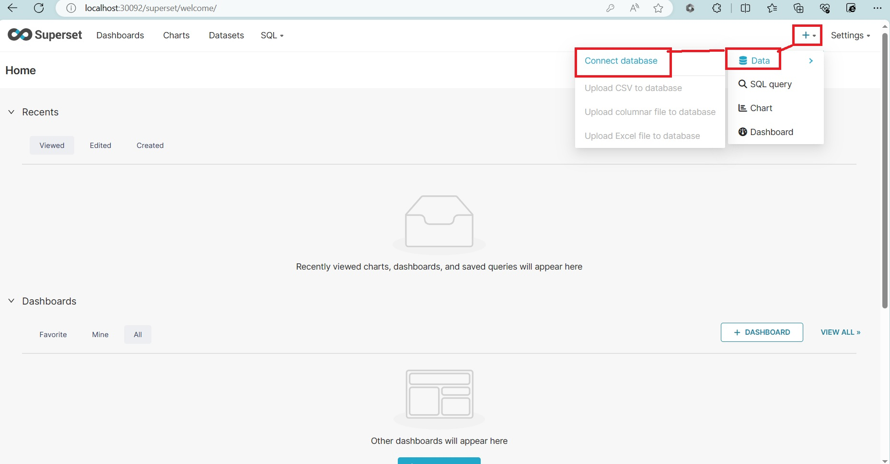
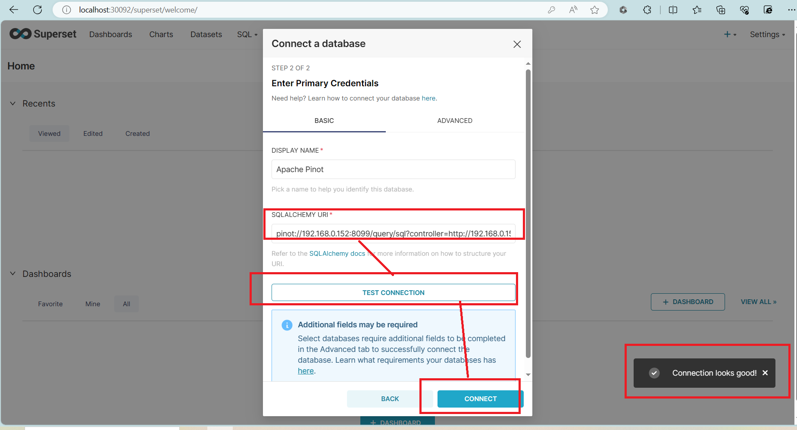

# Superset

### Create Custom image

To work with Pinot, Superset needs external connectos, and hence we need to create a custom image

```bash
# Pull the latest image
docker pull apache/superset
```

### Write custom docker file 

```shell
cd superset-pinot
```
#### Create a file for python deps

```shell
vim requirements.txt
```

Add required external dependencies

```shell
pinotdb
psycopg2
pymssql
```

#### Create a custom docker file

```shell
vim Dockerfile
```

```Dockerfile
FROM apache/superset
# Switching to root to install the required packages
USER root

COPY requirements.txt /tmp/requirements.txt

RUN pip install -r /tmp/requirements.txt

# Switching back to using the `superset` user
USER superset
```
#### Build

```shell
docker build -t superset-pinot .
```

### Spin up Superset
 
```shell
## Create a secret key
openssl rand -base64 42

## Create superset container from custom image
docker run -d -p 30092:8088  \
--name custom-superset \
-e "SUPERSET_SECRET_KEY=9QIw0foPjEtqbeZAJB0pSwhYXpsZ3Jnn3NqBJrWn/gaWVjhBSuEf58LV" \
superset-pinot
```

#### Initialize Superset

```shell
# Migrate local DB to latest ( This step is time consuming )
docker exec -it custom-superset superset db upgrade

# Setup roles  ( This step is time consuming )
docker exec -it custom-superset superset init

## Setup your local admin account
docker exec -it custom-superset \
superset fab create-admin \
--username admin \
--firstname Superset \
--lastname Admin \
--email admin@superset.com \
--password admin
```

UI : http://localhost:30092/login
u/p: [admin/admin]

### Pinot Superset Integration

Once you login to Superset...



Pinot Connection URL : `pinot://<Your_Machine_IP>:8099/query/sql?controller=http://<Your_Machine_IP>:9120/`



In the SQLLab :


## References

https://docs.pinot.apache.org/integrations/superset